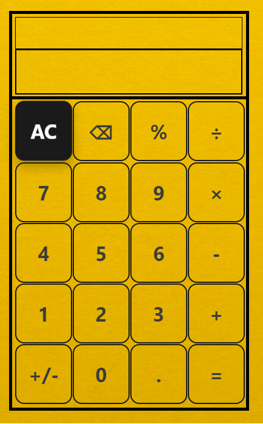

# calculator
### A calculator made using HTML/CSS/JS, an exercise for [TheOdinProject](theodinproject.com)
#### Click on the picture/the link below to try!

## [Click to open](https://redplusblue.github.io/calculator/)

## Features
1. Can calculate +, -, /, * and % of positive and negative numbers as well as decimals. 
2. Can hover and copy text on display by clicking on it!
3. Can use the keyboard to enter numbers/operations and `backspace/delete` to clear, and `Enter` to evaluate.

## What I used/learnt: 
1. HTML
2. CSS: Grid, Flexbox, Inline-block, media queries, :hover, :link
3. JS: Event Listeners, Array Operations, Function calls, Regular Expressions
